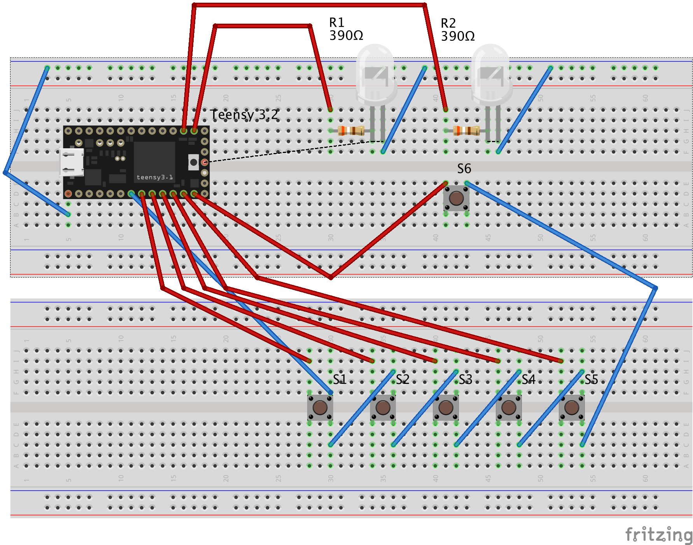

# teensyを使ってキーボードを作る

## 必要なもの
### Arduino IDE
開発環境  
https://www.arduino.cc/en/main/software

### teensy duino
Arduino IDEでteensyを使うようにするプラグイン  
※これがないと開発できません  
https://www.pjrc.com/teensy/td_download.html

### teensy loader
ソースをteensyへ書き込むアプリ  
https://www.pjrc.com/teensy/loader.html

## 回路図

## 初期キーマップ

### レイヤー 0
* sw1
ctrl + a
* sw2
ctrl + c
* sw3
ctrl + x
* sw4
ctrl + v
* sw5
ctrl + alt + del
* sw6
レイヤー切り替え

### レイヤー 1
* sw1
前のトラック
* sw2
プレイ or ポーズ
* sw3
次のトラック
* sw4
音量--
* sw5
音量++
* sw6
レイヤー切り替え

## レイヤーの状態について
* 左のLED 点灯
レイヤー0がアクティブ

* 右のLED 点灯
レイヤー1がアクティブ
